# 🛠️ **Daily-Youtube-Extraction**

## Sobre

Daily-Youtube-Extraction se trata de um projeto de Engenharia de Dados e de Análise de Dados, onde um ambiente completo é configurado, para extrair dados do trendings do youtube, salvar esses dados, levar para um sistema de buckets e processa-los utilizando Apache Spark. Para então realizar análises desses dados.

Siga as instruções para fazer o ambiente funcionar e se comunicar por completo.

## 🏗️ Arquitetura

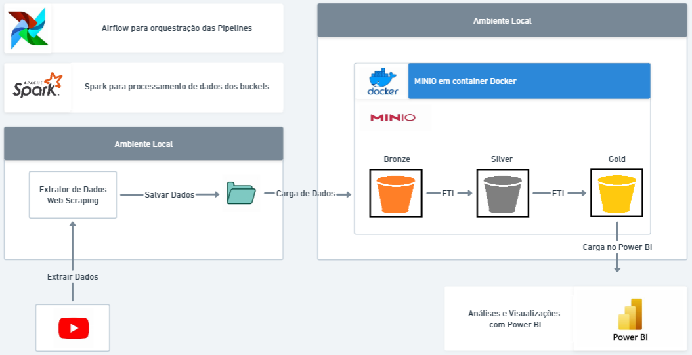

### extractors:
Aplicação responsável por fazer a coleta de dados. Ele foi desenvolvido em um outro projeto meu, ele realiza a extração de dados do youtube, trendings, videos, canais. Tudo feito por Web Scraping, é realizada diversas requisições ao youtube e os dados são extraidos, preparados e retornados em dicionários.

- collect_channels (Coleta dados de canais)
- collect_trending (Coleta o url de todos os videos no trendings)
- collect_video (Coleta dados de vídeos)

## 🔧 Configuração

### 0. Clonar repositório
Para clonar o repositório para sua maquina:

```
git clone https://github.com/GustavoNav/Daily-Youtube-Extraction
```

Acessar o diretório:

```
cd Daily-Youtube-Extraction
```

### 1. Ambiente Virtual
É necessário Python 3.10.12
<br>Crie o ambiente Python dentro do diretório:
```
python3 -m venv venv
```

Ative o ambiente:

```
source venv/bin/activate
```

Instale os requirements:

```
pip install -r requirements.txt
```

### 2. Minio
É necessário Docker version 24.0.7

Baixar a imagem do Minio e iniciar o container, lembre de mudar o MINIO_ROOT_USER e o MINIO_ROOT_PASSWORD
```
docker run \
   -p 9000:9000 \
   -p 9001:9001 \
   --name minio \
   -v ~/minio/data:/data \
   -e "MINIO_ROOT_USER=ROOTNAME" \
   -e "MINIO_ROOT_PASSWORD=CHANGEME123" \
   quay.io/minio/minio server /data --console-address ":9001"
```

Agora acesse em seu navegador o endereço: http://127.0.0.1:9001
Coloque o usuário e senha que acabou de criar na definição do container e acesse.

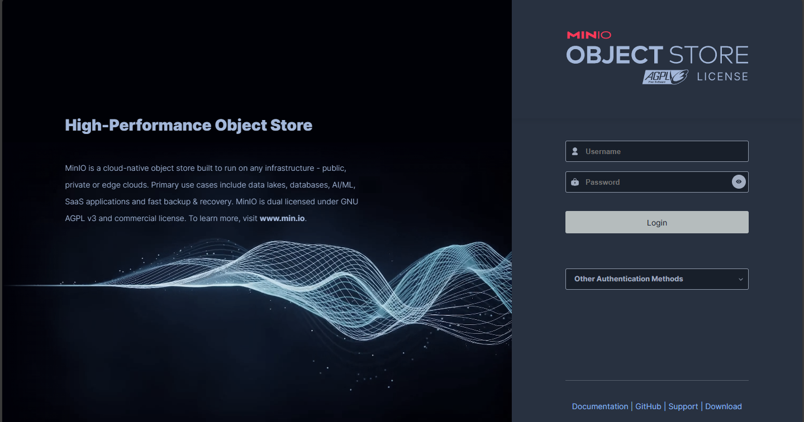

Você será levado a tela de Object Browser, na parte esquerda busque por Buckets, onde deve clicar em Buckets (marcado com vermelho na imagem).

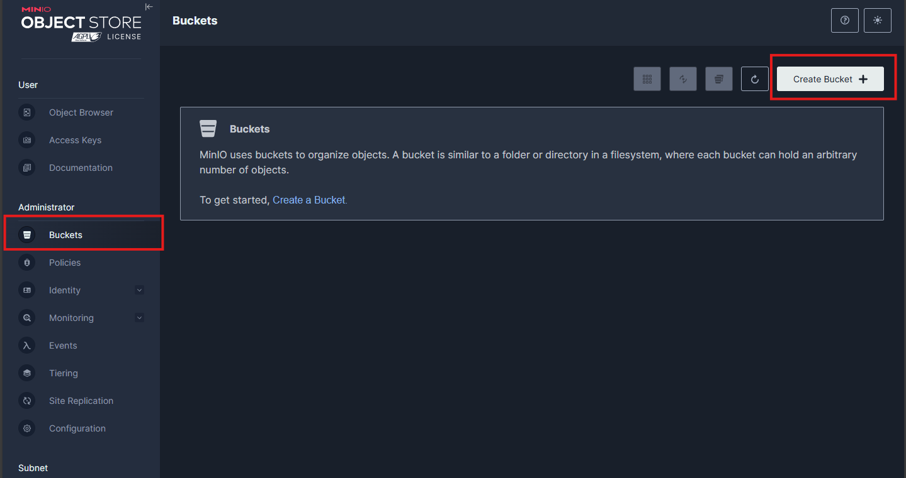

Agora você deve criar 3 buckets com os nomes:
- youtube-data-bronze
- youtube-data-silver
- youtube-data-gold

O Object Browser deve ficar assim:

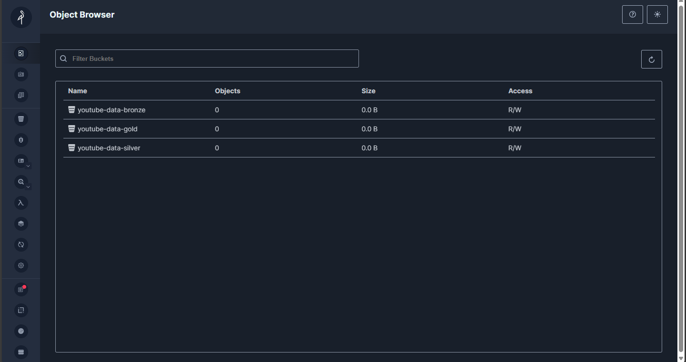


Agora vamos criar uma Access Keys, novamente, na esquerda busque por Access Keys e por Create Access Key na direita:

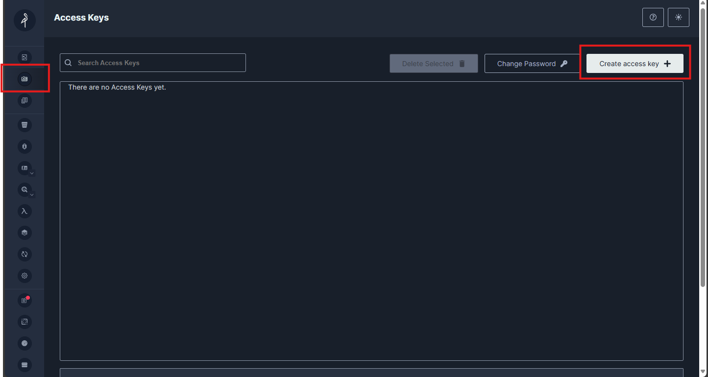

Não é preciso modificar nada, apenas crie e será mostrado para você sua Access e Secret key (Não compartilhe elas!).

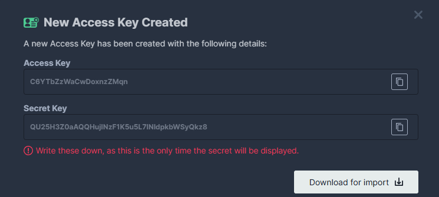

Agora em nosso diretório raiz do projeto, vamos criar o arquivo keys_s3.py, e nele colocar ambas as keys:

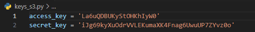


### 2. Apache Spark

O Apache Spark é instalado localmente na sua maquina, é utilizado a versão 3.5.2
<br>Ao instalar o requirements o PySpark já veio incluso:

```
pip install pyspark
```

Instale o Java:
```
sudo apt update
sudo apt install default-jdk -y
```

Baixe o Apache Spark:

```
wget https://dlcdn.apache.org/spark/spark-3.5.2/spark-3.5.2-bin-hadoop3.tgz
```

Extraia o arquivo:

```
tar -xvf spark-*.tgz
```

Crui um novo diretório no opt e mova o Apache Spark:

```
sudo mkdir -p /opt/spark
sudo mv spark-* /opt/spark
```

Agora vamos configurar as variáveis de ambiente:

```
vim ~/.bashrc
```

Ao final do arquivo adicione:

```
export SPARK_HOME=/opt/spark
export PATH=$SPARK_HOME/bin:$PATH
```
Salve as alterações.

<br>Aplique as alterações:

```
source ~/.bashrc
```

### 3. Apache Airflow
O Apache Airflow foi baixado pelo pip, então ele já vem ao instalar o requirements.

Defina a variável HOME do airflow para o seu ambiente atual (o do projeto).

```
export AIRFLOW_HOME=<abs_path>
```

Executar o comando para iniciar o Airflow:

```
airflow standalone
```

O airflow vai colocar todos seus recursos para funcionar, configurações, scheduler, banco de dados. Vai ser criado um arquivo chamado 'airflow.cfg' abra ele para realizar algumas configurações.

- Busque por load_examples e troque para False:
<br>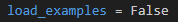

- Busque por remote_log_conn_id e coloque a sua frente: my_s3_conn:
<br>

Encerre o Airflow standalone no terminal, pressionando CTRL + c
Por fim o execute novamente.

```
airflow standalone
```

Agora, em seu navegador acesse o endereço: http://localhost:8080/
Aqui você deve realizar o login, por padrão o usuário é 'admin' e a senha fica disponível no arquivo 'standalone_admin_password.txt' no diretório raiz do projeto.

Na tela principal você deve acessar Admin e Connections:

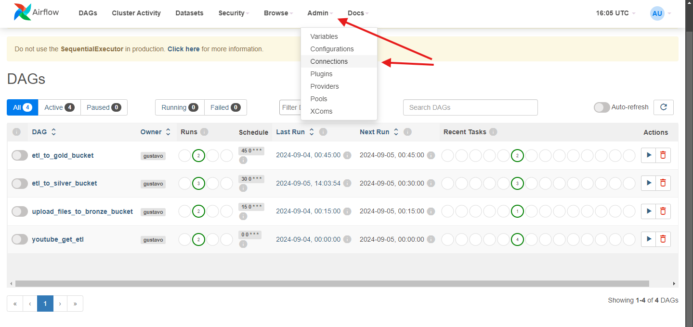

Aperte no botão de mais para adicionar uma nova conexão:

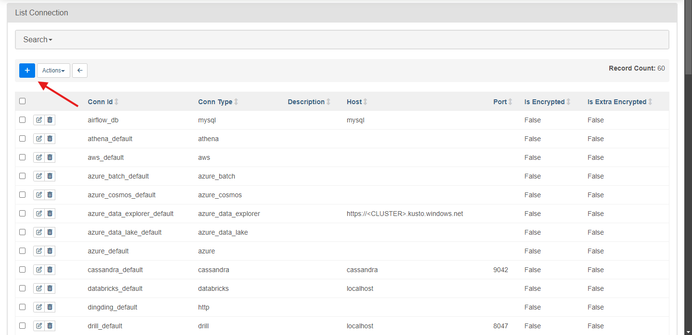

Agora configure a conexão com o Minio, não altere nada, caso contrário vai gerar erros, apenas coloque suas Keys:
- Connection Id: my_s3_conn
- Connection Type: Amazon Web Services
- AWS Access Key ID: Sua Acesss key
- AWS Secret Key ID: Sua Secret Key
- Extra: {"endpoint_url": "http://localhost:9000"}

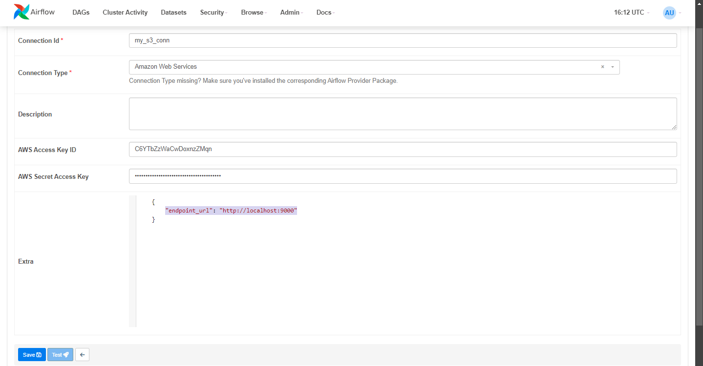

Salve a conexão.

Agora vamos adicionar o path aos arquivo: etl_youtube.py, etl_silver_bucket.py e etl_gold_bucket.py

Mude a linha de código  no inicio de cada arquivo para direcionar ao diretório onde está o projeto na sua maquina.
```
sys.path.append(os.path.expanduser('~/projetos/projeto_airflow'))
```


## Execução
Para executar, é necessário que o container do Minio esteja ativo e o airflow online.
<br>Basta acessar o endereço em seu navegador: http://localhost:8080/
<br>Faça login no Airflow e então na tela de DAGS ativar as DAGS em sequência (note, se de qualquer forma pode gerar erro).

<br>youtube_get_etl >> upload_files_to_bronze_bucket >> etl_to_silver_bucket >> etl_to_gold_bucket

<br>Ativide uma por vez e aguarde sua execução encerrar antes de ir para a próxima. Dessa forma o airflow vai ficar programado para executar todos os dia as DAGS.
